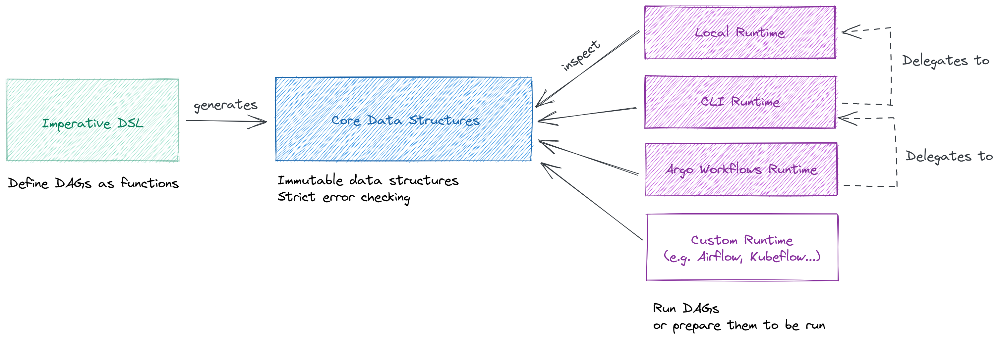

# Dagger

Define sophisticated data pipelines and run them on different distributed systems (such as Argo Workflows).


[](https://badge.fury.io/py/py-dagger)
[](https://codecov.io/gh/larribas/dagger)


---

## Features

- Define tasks and DAGs, and compose them together seamlessly.
- Create dynamic for loops and map-reduce operations.
- Run your DAGs locally or using a distributed workflow orchestrator (such as Argo Workflows).
- Take advantage of advanced runtime features (e.g. Retry strategies, Kubernetes scheduling directives, etc.)
- ... All with a simple _Pythonic_ DSL that feels just like coding regular Python functions.


Other nice features of _Dagger_ are: Zero dependencies, 100% test coverage, great documentation and plenty of examples to get you started.


## Installation

_Dagger_ is published to the Python Package Index (PyPI) under the name `py-dagger`. To install it, you can simply run:

```
pip install py-dagger
```

## Looking for Tutorials and Examples?

Check our [Documentation Portal](https://larribas.me/dagger)!


## Architecture Overview

_Dagger_ is built around 3 components:

- A set of __core data structures__ that represent the intended behavior of a DAG.
- A __domain-specific language (DSL)__ that uses metaprogramming to capture how a DAG should behave, and represents it using the core data structures.
- Multiple __runtimes__ that inspect the core data structures to run the corresponding DAG, or prepare the DAG to run in a specific pipeline executor.


[](docs/assets/images/diagrams/components.png)


## How to contribute

Do you have some feedback about the library? Have you implemented a Serializer or a Runtime that may be useful for the community? Do you think a tutorial or example could be improved?

Every contribution to _Dagger_ is greatly appreciated.

Please read our [Contribution Guidelines](CONTRIBUTING.md) for more details.


### Local development

We use Poetry to manage the dependencies of this library. In the codebase, you will find a `Makefile` with some useful commands to run and test your contributions. Namely:

- `make install` - Install the project's dependencies
- `make test` - Run tests and report test coverage. It will fail if coverage is too low.
- `make ci` - Run all the quality checks we run for each commit/PR. This includes type hint checking, linting, formatting and documentation.
- `make build` - Build the project.
- `make docker-build` - Package the project in a Docker image
- `make docs-build` - Build the documentation portal.
- `make docs-serve` - Serve the documentation portal.
- `make k3d-set-up` - Create a k3d cluster and image registry for the project.
- `make k3d-docker-push` - Build and push the project's Docker image to the local k3d registry.
- `make k3d-install-argo` - Install Argo on k3d, for local testing of Argo Workflows.
- `make k3d-tear-down` - Destroy the k3d cluster and registry.
