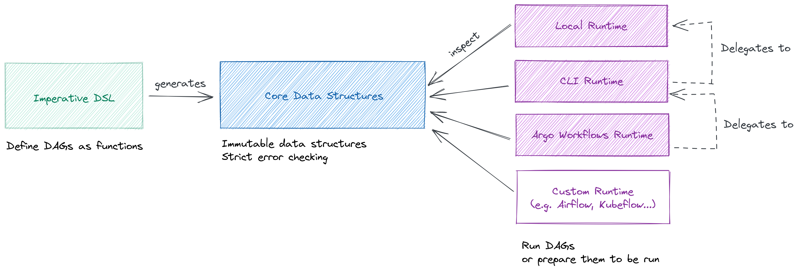

# Dagger

_Dagger_ is a Python library that allows you to:

* Define sophisticated DAGs (direct acyclic graphs) using very straightforward Pythonic code.
* Run those DAGs seamlessly in different runtimes or workflow orchestrators (such as Argo Workflows, Kubeflow Pipelines, and more).

## 🧰 Features

- Express DAGs succinctly.
- Create dynamic for loops and map-reduce operations.
- Invoke DAGs from other DAGs.
- Run your DAGs locally or using a distributed workflow orchestrator (such as Argo Workflows).
- Take advantage of advanced runtime features (e.g. Retry strategies, Kubernetes scheduling directives, etc.)
- ... All with a simple _Pythonic_ DSL that feels just like coding regular Python functions.

Other nice features of _Dagger_ are: it adds __no extra dependencies__ to your project, it is __reliable__ (with 100% test coverage), and it has __great documentation and plenty of examples__ to get you started.

## 🎯 Guiding Principles

_Dagger_ was created to facilitate the implementation and ongoing maintenance of data and ML pipelines.

This goal is reflected in _Dagger_'s architecture and main design decisions:

- To make __common use cases__ and patterns (such as dynamic loops or map-reduce operations) __as easy as possible__.
- To __minimize boilerplate, plumbing or low-level code__ (with _Dagger_ you don't need to serialize your outputs, store them in a remote file system, download them and deserialize them again; all of this is done for you).
- To __onboard users in just a couple of hours__ through great documentation, comprehensive examples and tutorials.
- To __never sacrifice reliability and performance__, and to keep a low memory footprint by using lazy loading and streaming I/O throughout the codebase.

## ⛩️ Architecture

_Dagger_ is built around 3 components:

- A set of __core data structures__ that represent the intended behavior of a DAG.
- A __domain-specific language (DSL)__ that uses metaprogramming to capture how a DAG should behave, and represents it using the core data structures.
- Multiple __runtimes__ that inspect the core data structures to run the corresponding DAG, or prepare the DAG to run in a specific pipeline executor.

### The Core Data Structures

_Dagger_ defines DAGs using a series of immutable data structures. These structures are responsible for:

- __Exposing all the relevant information__ so that runtimes can run the DAGs, or translate them into formats supported by other pipeline executors.
- __Validating all the pieces of a DAG__ to catch errors as early as possible in the development lifecycle. For instance:
    * Node inputs must not reference outputs that do not exist.
    * The DAG must not contain any cycles.
    * Nodes and outputs are partitioned in ways supported by the library.
    * etc.

They are divided into different categories:

- __Nodes__ may be tasks (functions) or DAGs (a series of nodes connected together). DAGs can be nested inside of other DAGs.
- __Inputs__ may come from a DAG parameter or from the output of another node.
- __Outputs__ may be retrieved directly from the return value of a task's function, or from a sub-element of that value (a key or a property).
- Every input/output has a __serializer__ associated with it. The serializer is responsible for turning the value of that input/output into a string of bytes, and a string of bytes back into its original value.

Does it sound interesting? [See it in action!](quick-start.md)

