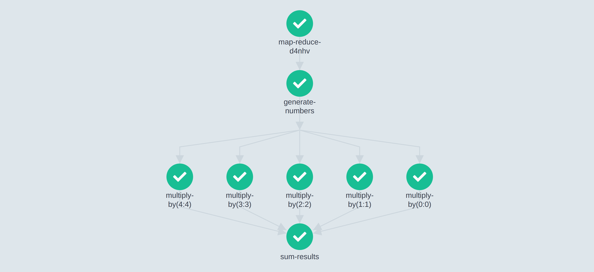

# Map-Reduce Patterns

One of the most common patterns you may find yourself implementing with _Dagger_ is a map-reduce operation.

Also known as a fan-out-fan-in or scatter-and-gather operation, a map-reduce has the following shape:

- There will be __a node producing a partitioned output__ (fan-out). This could be a list of countries, a dataset split into multiple chunks, or any other segmentation strategy you may be using in your project.
- After the partitions are generated, __a number of "mapping" nodes will run in parallel__, processing each of the partitions and generating a partial result.
- Finally, there will be a node that waits until all the "mapping" nodes have finished and will __aggregate the partial results__.

The following picture shows how _Argo Workflows_ represents the execution of a very basic map-reduce DAG:

[](../../assets/images/argo/map_reduce.png)


## Common Use Cases

Here are some common map-reduce implementations we've seen in _Dagger_:

* A pipeline that trains multiple version of a Machine Learning model and then picks the one that performs best.
* A pipelines that trains ML models for different countries in parallel, uploads each separately, and then integrates the metadata of every training session into a single human-readable report.
* An ETL pipeline that splits a large dataset into chunks, aggregates each chunk into a partial result and then aggregates all the partial results together (for instance, to calculate the average delivery time of different types of orders).


## Example

The following example demonstrates how we can use _Dagger_ to implement a Machine Learning training pipeline that trains multiple versions of a model in parallel, and then picks the one that performs the best against a test suite.


=== "Imperative DSL"

    ```python
    --8<-- "docs/code_snippets/map_reduce/imperative.py"
    ```

=== "Declarative Data Structures"

    ```python
    --8<-- "docs/code_snippets/map_reduce/declarative.py"
    ```


## Limitations

As explained in the [partitioning limitations](partitioning.md#limitations) section, map-reduce patterns in _Dagger_ have very specific constraints.

At first sight, these constraints may look too limiting, but in the long run they will make your code more understandable and predictable, and the _Dagger_ codebase more stable and extensible.

In this section we will go through the different constraints and show you how you can overcome them.


### You can only have 1 mapping node

Say you have a DAG where you want to perform multiple mapping operations after a fan-out.

In _Dagger_, you cannot do this in the same `for` block. Instead, you need to wrap all the mapping operations inside of another DAG.

This also allows you to keep most map-reduce DAGs to a single line: `return reduce([map(partition) for partition in fan_out()])`.


=== "Invalid pattern"

    ```python
    --8<-- "docs/code_snippets/map_reduce/limitations/single_mapping_node/invalid.py"
    ```

=== "Solution"

    ```python
    --8<-- "docs/code_snippets/map_reduce/limitations/single_mapping_node/valid.py"
    ```


### You cannot parallelize directly from a DAG parameter

Say you have a DAG where you receive all potential partitions at runtime as a parameter.

In _Dagger_, you cannot do a `for` loop directly over the parameter. Only the outputs of other nodes may be iterable.

The solution here would be to transform that parameter into a node output by just passing it through an "identity" function (that is, a function that returns the same parameters it received).


=== "Invalid pattern"

    ```python
    --8<-- "docs/code_snippets/map_reduce/limitations/for_based_on_param/invalid.py"
    ```

=== "Solution"

    ```python
    --8<-- "docs/code_snippets/map_reduce/limitations/for_based_on_param/valid.py"
    ```


### You cannot nest two for loops together

Say you have two sets of partitions (e.g. user cohorts and product types) and you want to create a DAG that produces recommendations for each combination of (user cohort, product type) in parallel.

In _Dagger_, you cannot nest multiple `for` loops within the same DAG.

Instead, you need to create 2 separate DAGs (each parallelizing by a different dimension) and invoke one from the other.


=== "Invalid pattern"

    ```python
    --8<-- "docs/code_snippets/map_reduce/limitations/nested_for_loops/invalid.py"
    ```

=== "Solution"

    ```python
    --8<-- "docs/code_snippets/map_reduce/limitations/nested_for_loops/valid.py"
    ```


### You cannot return the output of a partitioned node from a DAG

Say you want to split a large dataset into smaller chunks, transform each chunk in parallel and then return the whole dataset as the result of the DAG.

In _Dagger_, DAG outputs can only come from the outputs of nodes that are not partitioned.

If you want to return the full dataset as the DAG's output you will need to concatenate the chunks back together in a fan-in/reduce task. You can use an "identity" function for this (a function that returns the same parameters it received).


=== "Invalid pattern"

    ```python
    --8<-- "docs/code_snippets/map_reduce/limitations/dag_output_from_partitioned_node/invalid.py"
    ```

=== "Solution"

    ```python
    --8<-- "docs/code_snippets/map_reduce/limitations/dag_output_from_partitioned_node/valid.py"
    ```


## Learn more about...

- How the [imperative DSL](../dsl/imperative.md) works.
- How to run your DAGs with the different [runtimes](../runtimes/alternatives.md).
