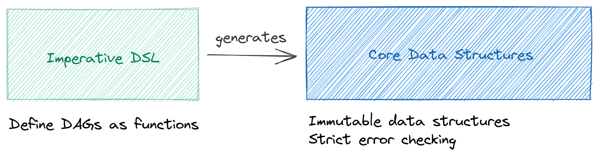

# Imperative DSL

If you've been following along the examples in the previous sections, you will have noticed there are two ways of defining your DAGs with _Dagger_: An imperative DSL and the (declarative) data structures.

The core data structures are the foundation of _Dagger_ (they are the language runtimes understand). However, as DAGs become more complex, the data structures can become quite verbose and difficult to understand.

To make the task of defining data pipelines as intuitive as possible, _Dagger_ also exposes an imperative [domain-specific language (DSL)](https://en.wikipedia.org/wiki/Domain-specific_language) whose _domain_ consists of defining DAGs.

__You can use the DSL to define DAGs as if you were writing local Python code__. What could be more natural than that?

[](../assets/images/diagrams/components_dsl_vs_core_ds.png)


## The Illusion of Control

Notice how in the last paragraph we said _"...as if you were writing local Python code"_?

One of the most important concepts to grasp when using _Dagger_'s DSL is that, __as soon as functions are decorated__ with `dagger.dsl.task` or `dagger.dsl.DAG`, __they stop behaving as regular Python functions__, so to speak.

Instead, they become `NodeInvocationRecorder` objects whose purpose is to __record how you expect a DAG to behave__ without actually executing any of its tasks.

When you do:

```python
@dsl.DAG()
def dag(sample_size):
    datasets = prepare_datasets(sample_size)
    model = train_model(datasets["training"])
    return measure_model_performance(model, datasets["test"])
```

This is what _Dagger_ is able to understand:

- From the signature of the function `dag`, the DSL knows the DAG has a single parameter named `sample_size`.
- Then, the DSL records your intention to invoke:
    * The task `prepare_datasets` passing the parameter as a single argument.
    * The task `train_model` passing the sub-key "training" from the output of `prepare_datasets`.
    * The task `measure_model_performance` passing both the output of `train_model` and the sub-key "test" from the output of `prepare_datasets`.
- Finally, the DSL interprets that you want to `return` the output of `measure_model_performance` as the output of the DAG.


## Build time vs. runtime

When you use a compiled language like C, your code has two phases: compilation (where C code gets transformed into machine code for a particular computer architecture) and execution (where the machine code is run by that computer architecture).

__You can think of the DSL as a compilation process that takes Python code and transforms it into a `dagger.DAG` data structure__.

Thus, when you do this:

```python
--8<-- "docs/code_snippets/build_vs_run_time/hello.py"
```

The string `"Hello at build time!"` will only be printed when you call `dsl.build()`, whereas the string `"Hello at runtime!"` will be printed when you call `invoke()`. Notice how the print statement is NOT executed at runtime.


Similarly, if you mix functions decorated with `@dsl.task()` and other Python functions, you may obtain unintended results. Take the following piece of code:

```python
--8<-- "docs/code_snippets/build_vs_run_time/mixing_decorated_and_undecorated_functions.py"
```

In this case, `coin_toss` will be invoked at build time and return heads or tails. The if condition will be evaluated at build time, which means when we call `dsl.build()`, it will generate one of two possible DAGs: a DAG that always orders Chinese food, or a DAG that always orders Italian. If you had intended to execute this DAG periodically and add some variety to your diet, we've got bad news: It seems you'll be stuck with the same type of food for some time!

This may or may not be what you intended. 

!!! note
    Mixing decorated and undecorated functions may certainly be useful. __What's important is that you are able to distinguish between the things that will happen at build time and the things that will happen at runtime__.


## Capabilities

Like with all domain-specific languages, __the number of things you can do inside of a function decorated with `dagger.dsl.DAG` is limited__. Here goes a short summary:

- Parameterize a DAG by adding arguments to its function signature.
- Invoke nodes passing literal or hardcoded values as parameters.
- Invoke nodes passing the outputs of other nodes as parameters.
- Access keys from a node's output, when the output of that node is a mapping (e.g. a dictionary).
- Access properties of a node's output, when the output of that node is an object (e.g. a data class).
- Iterate over the results of an invocation to parallelize the execution of a node.
- Add all the results of a partitioned node in a list and pass that list to a fan-in node.
- Return multiple outputs from the DAG by returning a dictionary of `#!python str -> node_output`.


## ⛔ Limitations

Technically speaking, anything that hasn't been listed as a capability in the previous section can be considered a limitation.

That said, there are some extra limitations to keep in mind when using the DSL:

- As far as we know, Python is not able to inspect the name of the local variable that holds a value. Therefore, when you assign the output of a task to a variable `#!python my_var = my_task()` and use it from `#!python another_task(my_var, my_var["my-key"], my_var.my_attr)`, the DAG you build from the DSL will name the outputs of `my_task`: `"return_value"`, `"key_my-key"` and `"property_my_attr"`.
- __Parameter defaults are ignored by the DSL__. A task with the signature `#!python def my_task(a, b=2)` will still expect `b` to be passed as a parameter every time it's used. The same is true for DAG parameters. This may change in the future, if [this feature request](https://github.com/larribas/dagger/issues/35) is implemented.
- __Only the outputs that are used by other tasks will be exported__. The rest will be omitted. If you assign the output of a task to a variable (`#!python output = my_task()`), but don't use the variable `output` again, _Dagger_ will assume you don't care about the output of that task. The task will still be executed, of course, but you may find the artifact not being saved in a runtime such as _Argo Workflows_.


## 🛠️ DSL Implementation

To be able to capture this definition from a simple Python function, we make extensive use of Python's [magic methods](https://rszalski.github.io/magicmethods/), [context variables](https://docs.python.org/3/library/contextvars.html) and other [metaprogramming](https://en.wikipedia.org/wiki/Metaprogramming) capabilities.

The specific implementation of _Dagger_'s DSL is quite interesting and will probably be the subject of an article in the future. Here are some of the highlights:

Functions decorated by `dagger.dsl.task` or `dagger.dsl.DAG` are converted into an instance of `NodeInvocationRecorder`. This object implements the magic method `#!python __call__(*args, **kwargs)` so that invoking the decorated function looks just like invoking the original function.

Whenever the function `#!python dagger.dsl.build(func_decorated_by_dag)` is called, it:

1. Inspects the signature of the DAG to look for parameters.
1. Creates a new [context](https://docs.python.org/3/library/contextvars.html) to isolate the definition of different DAGs (as we use global variables to record node invocations).
1. Runs the body of the decorated function within that context.

When we run the body of a function decorated with `dagger.dsl.DAG`, we may be invoking `#!python NodeInvocationRecorder.__call__()` multiple times. Each invocation:

* Generates a unique ID for the execution of that task.
* Binds the `*args, **kwargs` to the arguments of the function we decorated.
* Marks all the inputs it receives as "consumed". We do this to understand which values from another task need to be exported as outputs.
* Registers itself on the global list of `node_invocations`.
* Returns an object of type `NodeOutputUsage`.

The purpose of a `NodeOutputUsage` is to record how the output of a node is used by the rest of the nodes in a DAG:

* If the output is never consumed, the DSL assumes the node that generated it doesn't need to export any outputs (since no other node seems to care about them).
* If the output is consumed directly, the DSL assumes we are interested in the return value as a whole.
* If a sub-key (`#!python __getitem__(str)`) or sub-property (`#!python __getattr__(str)`) of the output is consumed, the DSL assumes we're interested in that sub-value.
* If the output it iterated upon (`#!python __iter__()`), the DSL assumes the output is partitioned, and so is the node that depends on the elements returned by that iterator.

__After all node invocations and output usages have been properly recorded, the `dagger.dsl.build()` method inspects them and generates a `dagger.DAG` data structure__.


## 📗 API Reference

Check the [API Reference](../api/dsl.md) for more details.


## 🧠 Learn more about...

- How to use [different serializers](serializers/alternatives.md) for your inputs and outputs.
- How to run your DAGs with the different [runtimes](runtimes/alternatives.md).
