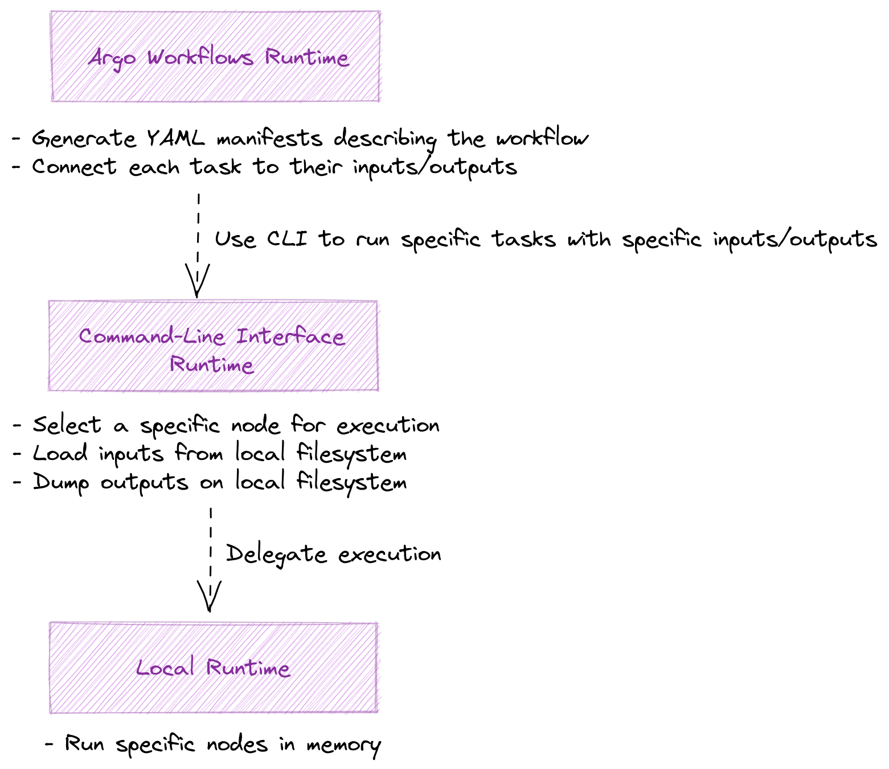
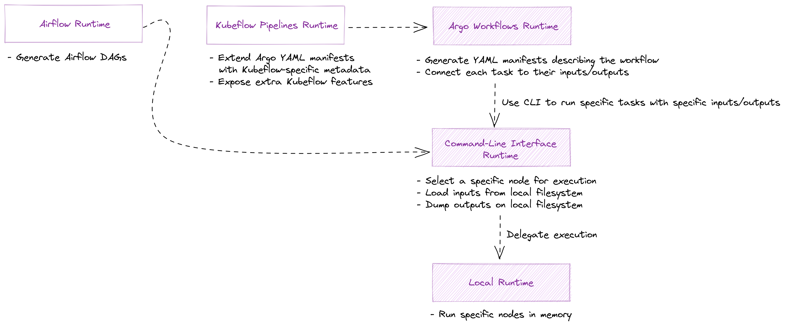

# Runtimes

Presumably, the reason why you're using _Dagger_ is to run your DAGs on a distributed workflow orchestration engine, such as [Argo Workflows](https://argoproj.github.io/workflows/).

In _Dagger_, the components that allow you to do this are called _Runtimes_.

## 📦 Built-in Runtimes

_Dagger_ comes with a handful of runtimes out of the box. Namely:

- [`dagger.runtimes.local`](local.md) - A local runtime that allows you to execute tasks and DAGs locally. You will use it mainly for testing purposes and local development. Other runtimes may use it under the hood to run certain tasks in a DAG.
- [`dagger.runtimes.cli`](cli.md) - A runtime that accepts inputs and outputs to a DAG from the local filesystem through command-line arguments. You will probably not use it directly, but other runtimes may use it to run certain tasks in a DAG.
- [`dagger.runtimes.argo`](argo.md) - A runtime that prepares your DAG to be executed by [_Argo Workflows_](https://argoproj.github.io/workflows/) on _Kubernetes_. This runtime does not execute your DAG directly, but it creates the resource manifests that tell _Argo_ how your DAG should be executed.

## 🎯 Leveraging Specific Runtime Features

Every workflow orchestration technology has its strengths and weaknesses.

When we were designing _Dagger_, one of our main tenets was that we didn't want to create an abstraction that relied on the lowest common denominator of all these technologies.

__We want to allow users to take advantage of the strengths of each runtime__. If you are using _Argo_, you should be able to use retry strategies or set complex scheduling rules for your _Kubernetes_ Pods. If you are using _Airflow_, you should be able to use the community plugins.

And you should be able to do all of this without needing to wait for a new version of the `py-dagger` library to be published!

To make this possible, __you can inject arbitrary "runtime options" to your tasks and DAGs__. Runtimes are free to inspect these extra options and use them to modify the way they execute or transform your DAGs.

Check the documentation for each runtime to understand which options are available.


### Example

In this example, we have a DAG with two tasks:

- A task that queries data from a database (on Argo, we want to retry this operation in case there's a temporary problem with the network).
- A task that processes that data (and needs a specific amount of memory and CPU power to do it efficiently).

We are also injecting some options to the DAG itself, but in this case, it is only for illustrative purposes.

=== "Imperative DSL"

    ```python
    --8<-- "docs/code_snippets/runtime_options/imperative.py"
    ```

=== "Declarative Data Structures"

    ```python
    --8<-- "docs/code_snippets/runtime_options/declarative.py"
    ```


## ⛩️ Runtime Architecture

Runtimes are built using a layered approach:

- The [Local runtime](local.md) specializes on executing specific nodes in a DAG.
- The [CLI runtime](cli.md) specializes on exposing a DAG through a machine-oriented interface, so that the different nodes in your DAG can be triggered from a container or virtual machine image. Once all the inputs have been obtained from the local filesystem, __the CLI runtime delegates the execution to the local runtime__.
- The [Argo runtime](argo.md) specializes on generating the resource manifests that describe the `kind: Workflow` resources _Argo_ and _Kubernetes_ will use to execute your DAG. Each task is executed inside of a container. __The Argo runtime expects the container to expose your DAG as a Command-Line Interface using the CLI runtime__.

The following diagram shows how the built-in runtimes interact with each other:

[](../../assets/images/diagrams/runtimes_built_in.png)


### Future Runtimes

Following the architecture introduced in the previous section, _Dagger_ can be extended to have any number of runtimes (some will be packaged with the library; some may be implemented in external or custom libraries).

For instance, you may want to build:

- A [Kubeflow Pipelines](https://www.kubeflow.org/docs/components/pipelines/overview/pipelines-overview/) runtime. Because _Kubeflow_ uses _Argo Workflows_ under the hood, __this runtime may rely on the Argo runtime to build the resource manifest, and then extend it with some Kubeflow-specific features and metadata__.
- An [Airflow](https://airflow.apache.org/) runtime which translates the `dagger.DAG` data structure into _Airflow_'s DAGs and operators, and uses the CLI interface to run certain tasks.


The following diagram represents how these new runtimes may fit into the current runtime architecture:

[](../../assets/images/diagrams/runtimes.png)


## 🛠️ Writing a Runtime

You can read [this guide](write-your-own.md) to understand how you can write a custom runtime.

